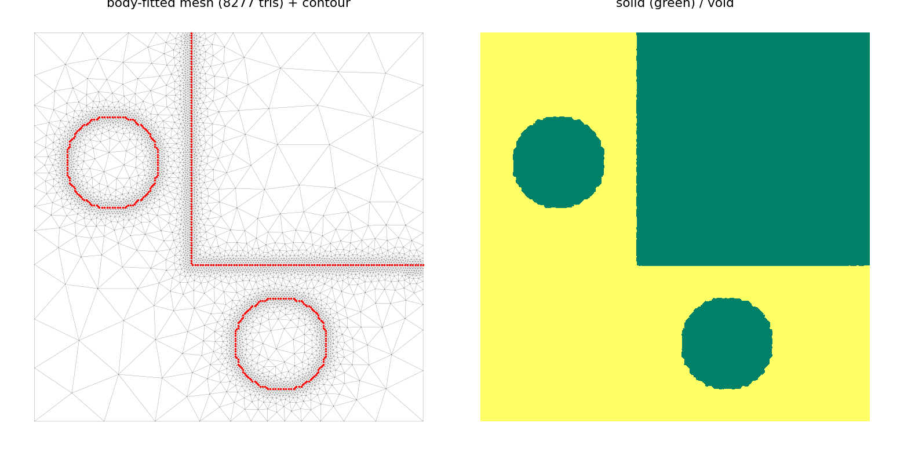
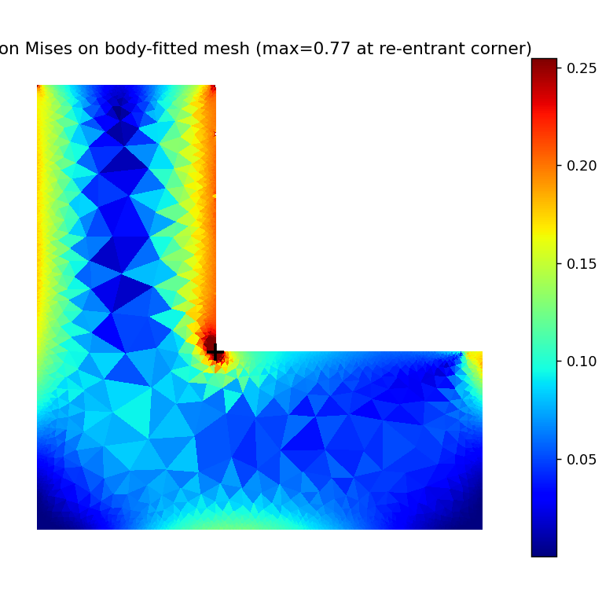

# Wasserstein Crossover EA for Topology Optimization (L-bracket, body-fitted HF)

A research prototype of an **evolutionary topology-optimization framework whose
crossover operator is the Wasserstein barycenter** of two material-density
distributions. The operator follows

> T. Kii, K. Yaji, H. Teramoto, K. Fujita, "Wasserstein crossover for
> evolutionary algorithm-based topology optimization", *CMAME* 451 (2026) 118713,

and is demonstrated on a single example — the **L-bracket** stress problem — with
a **body-fitted-mesh high-fidelity (HF) stress model** ported from

> Z. Zhuang, Y. Xiong, Y. He, Y.M. Xie, "...density projection and body-fitted
> mesh" (DPTO), *Engineering Structures* 349 (2026) 121854.

> Only original code is in this repo; neither paper's PDF/source is redistributed.

> **⚠️ Status / honesty.** This is a *prototype*, not a 1:1 numerical
> reproduction of either paper. The most defensible result is the **operator
> level** (the Wasserstein barycenter transports material and can produce
> offspring that beat their parents). An external review found two P0 integration
> bugs in the body-fitted HF (the fixed support became void; the applied load
> scaled with mesh spacing); both are now fixed and verified (below), and a
> connectivity guard makes the HF robust to disconnected offspring (no more
> solver segfaults). **The clean re-run verdict is negative:** on the
> physically-correct sharp-corner L-bracket with a stress LF, the Wasserstein-
> crossover EA does **not** meaningfully improve designs (HV +0.0%, matched-volume
> best-J₁ flat except one within-noise point). The earlier "−32 %" improvement
> numbers were artifacts of the buggy HF plus a fillet and are **retracted**. See
> [§12 of the project review](ADVERSARIAL_PROJECT_REVIEW.md) for the mechanism.

---

## Components and their validation

| Component | File | Validation |
|---|---|---|
| Wasserstein barycenter crossover (conv. Sinkhorn, Eqs. 10–13, adaptive ε) | [`src/wasserstein.py`](src/wasserstein.py) | morphing demo; deterministic unit tests ([`test_operator.py`](experiments/test_operator.py)) |
| Q4 plane-stress FEM + SIMP + P-norm stress LF (adjoint) | [`src/topopt.py`](src/topopt.py) | adjoint vs finite differences ≈ 2e-5 ([`test_fem.py`](experiments/test_fem.py)) |
| MMA optimizer | [`src/mma.py`](src/mma.py) | used by the stress LF |
| NSGA-II selection + hypervolume + **elitism** (per-objective extremes kept) | [`src/selection.py`](src/selection.py) | unit tests incl. elitism regression |
| Body-fitted-mesh HF (contour → DistMesh → CST → von Mises) | [`src/bodyfitted.py`](src/bodyfitted.py) | CST patch test exact; **MATLAB cross-check to ~1e-12**; mesh quality |
| EA framework loop (Algorithm 3) | [`src/framework.py`](src/framework.py) | end-to-end runs |
| L-bracket problem (LF + body-fitted HF) | [`src/lbracket.py`](src/lbracket.py) | see below |

What is **not** claimed: a paper-level framework reproduction, a contour-conforming
(constrained) mesh, or a verified DPTO end-to-end match (only the element FEA is
cross-checked, on identical meshes).

## The L-bracket problem

A 150×150 domain with an upper-right **passive void** (the L), a **sharp**
re-entrant corner at (60,60) (no fillet), the top edge of the vertical arm fixed,
and a downward load on the right tip of the horizontal arm.

- **LF (seeds the population):** density-method **P-norm von Mises stress**
  minimization on a structured grid with the passive void (SIMP + density filter
  + MMA), seeded over filter radius and volume fraction.
- **HF (drives the EA):** the design is resampled onto a node grid, the 0.5
  iso-contour is meshed body-fitted (DistMesh), and the **true max von Mises**
  (+ volume fraction) is evaluated on it, averaged over a few mesh seeds.

The body-fitted HF reproduces the L-bracket stress physics (concentration at the
re-entrant corner):

<p align="center">
  
  
</p>

## P0 fixes (just applied) and their acceptance checks

| Bug (external review) | Fix | Acceptance |
|---|---|---|
| `_to_hf_field` zero-filled the domain boundary → fixed support became `Emin` void → structure floating | edge-clamp the LF→HF interpolation so material reaches the boundary | fixed nodes incident to a solid triangle **0/33 → 15/34**; **max\|U\| 8.1e8 → 2.8e2** |
| `lbracket_bcs` applied `−F0/lload` per node → total load scaled with mesh spacing (−0.5 at the EA's `h=2`) | consistent nodal loads (tributary length) | total Fy = **−1.0 at every spacing** (0.5/1/2/3) |
| disconnected offspring → singular `spsolve` → **C-level segfault** (uncatchable in Python) crashed the run at t=3 | `_load_path_ok` connectivity guard: skip the solve (J₁=inf) unless solid joins support↔load in one component | floating / split designs return `inf` (no crash); full run completes (exit 0) |

## Layout & quick start

```
src/  wasserstein.py  topopt.py  mma.py  selection.py  bodyfitted.py  lbracket.py  framework.py
      topo_selection.py   (optional PH-Wasserstein selection; needs the TDA env)
experiments/  test_operator.py  test_fem.py  test_bodyfitted.py  demo_morphing.py  run_lbracket.py
```

```bash
pip install -r requirements.txt          # numpy scipy matplotlib (jax optional)
python experiments/test_operator.py      # operator / selection / hypervolume unit tests
python experiments/test_fem.py           # FEM + adjoint sensitivity
python experiments/test_bodyfitted.py    # body-fitted HF (patch test, mesh, physics)
python experiments/run_lbracket.py       # L-bracket Wasserstein-crossover EA (sharp corner)
```

## Honest limitations (tracked)

- L-bracket EA **does not improve designs** in the clean re-run (sharp corner +
  stress LF + fixed HF): HV +0.0 %, matched-volume best-J₁ flat. Root cause is a
  near-zero LF↔HF gap (stress LF seeds are already near stress-optimal) — barycenter
  blends of stress-optimal parents are systematically worse, and ~half are
  disconnected. The decisive next experiment is a crossover ablation (Wasserstein
  vs linear vs none).
- HF is a **boundary-refined Delaunay** with centroid solid/void classification —
  not a constrained contour-conforming mesh.
- Mesh-to-mesh noise (~3–5% CV) is reduced by seed-averaging, not eliminated;
  results should be checked on **held-out mesh seeds** (winner's curse).
- `ph_wasserstein` is an **inspired approximation**, not an exact implementation
  of the paper's persistent-homology selection.
- HF objective is the **true max** (mesh-sensitive at the sharp corner), not
  DPTO's smooth p-norm; single EA seed; no crossover ablation yet.

See [`ADVERSARIAL_REVIEW.md`](ADVERSARIAL_REVIEW.md) and
[`ADVERSARIAL_PROJECT_REVIEW.md`](ADVERSARIAL_PROJECT_REVIEW.md) for the full
critique and the running list of what is / isn't supported by evidence.
