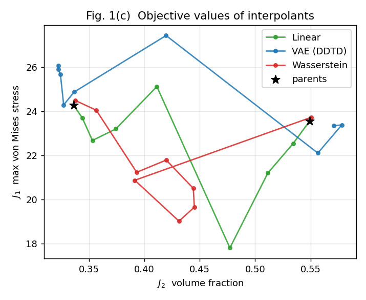
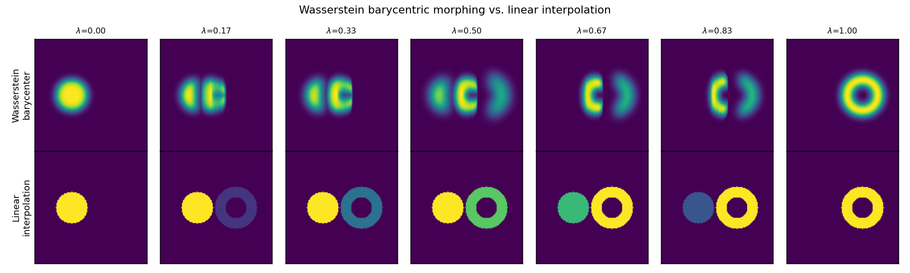
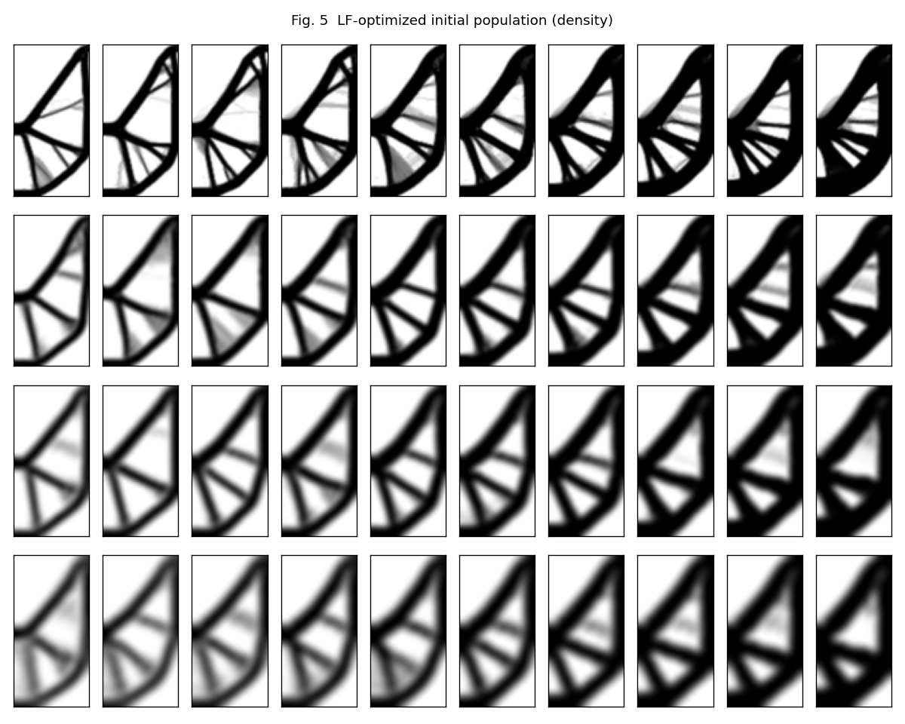
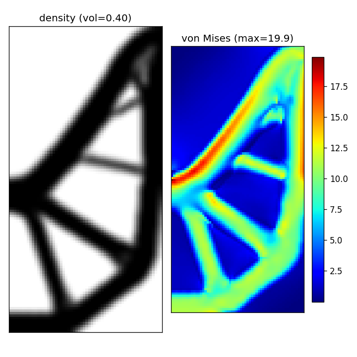
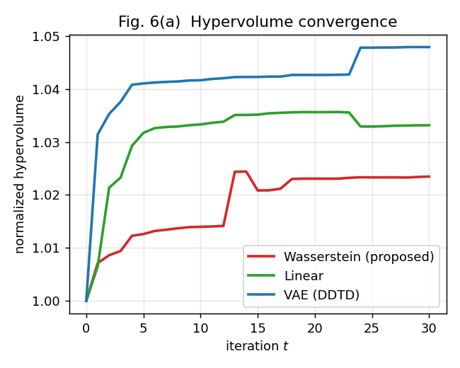
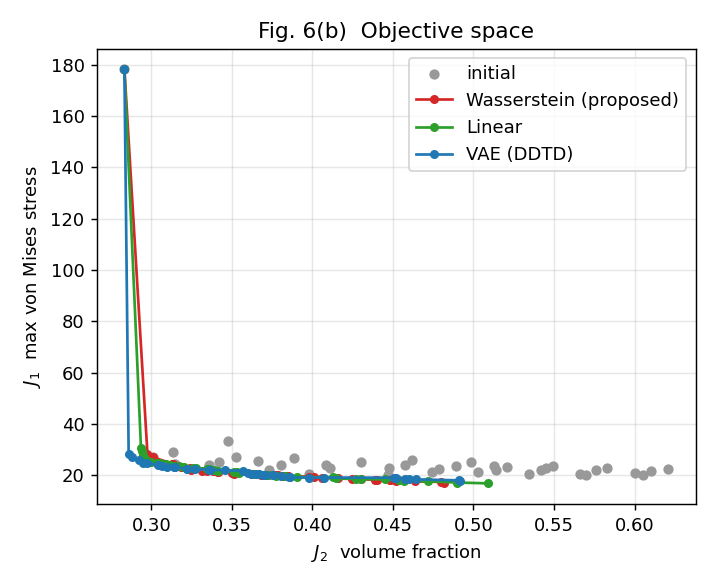
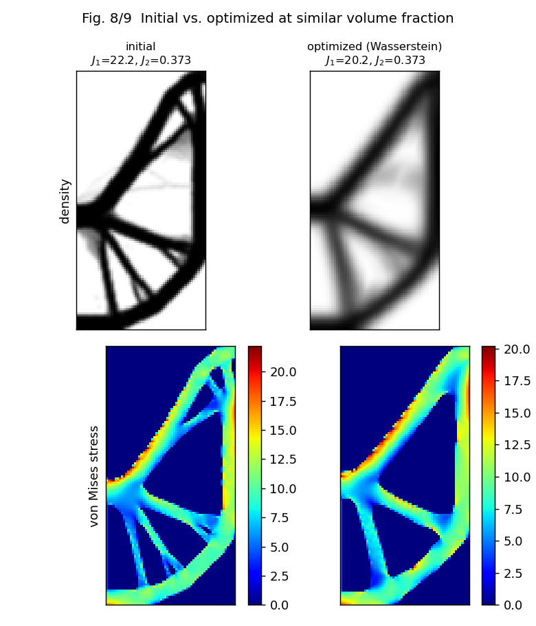
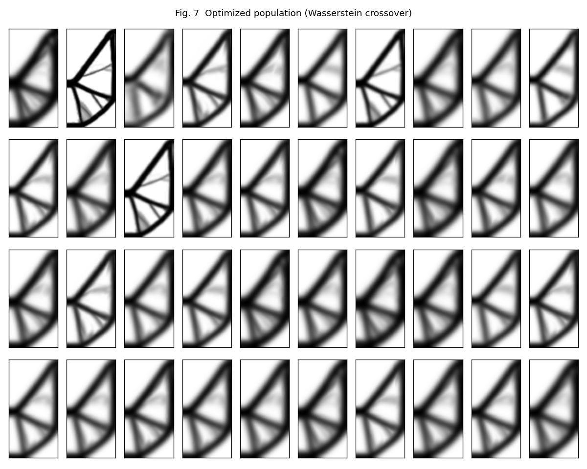

# Wasserstein Crossover for EA-based Topology Optimization — Reproduction

A self-contained **Python** reproduction of the method in:

> T. Kii, K. Yaji, H. Teramoto, K. Fujita,
> **"Wasserstein crossover for evolutionary algorithm-based topology optimization"**,
> *Computer Methods in Applied Mechanics and Engineering* **451** (2026) 118713.
> https://doi.org/10.1016/j.cma.2025.118713

The paper introduces a new crossover operator for evolutionary topology
optimization: offspring are generated as the **Wasserstein barycenter** of two
parent material-density distributions (treated as probability distributions),
replacing the VAE-based crossover of data-driven topology design (DDTD). This
repository **implements the algorithmic core** and demonstrates it end-to-end on a
**reduced, structured-grid substitute** of the paper's flagship example — the 2D
cracked-plate maximum-stress minimization (Section 5.1).

> **⚠️ Scope & status (read this first).** This is a faithful reproduction of the
> *method/mechanism*, **not** a 1:1 numerical reproduction of the paper's results.
> The finite-element back-end (COMSOL → in-house structured-grid FEM), the
> high-fidelity stress evaluation (body-fitted isosurface mesh → structured-grid
> hard binarization), and the second-stage diversity selection (persistent
> homology → design-space farthest-point) are **substitutes**; only the 2D
> stress example is covered, at reduced resolution/population. In the default run,
> the paper's headline result — Wasserstein crossover beating VAE at the
> *framework* level — is **not** reproduced (the operator-level advantage is; see
> [TL;DR](#tldr--what-this-shows-and-what-it-doesnt) and [Results](#results-demo-config-60120-grid)).

> **Note on the paper.** This repo contains only original code and figures
> generated by that code. The article PDF and any text/figures extracted from it
> are **not** redistributed here (copyright).

---

## TL;DR — what this shows (and what it doesn't)

**Operator level — clearest result (Section 2.3 / Fig. 1c).** Interpolating two
parent designs, the **Wasserstein** operator produces intermediate structures
that reach **lower max-stress than either parent** and Pareto-**dominate the
higher-volume parent**, whereas VAE interpolants scatter to *worse* stress and
linear interpolation merely cross-fades.

> Earlier wording here said the Wasserstein interpolants "dominate both parents".
> That was inaccurate and has been corrected: no single interpolant dominates the
> *lowest-volume* parent, because an intermediate design cannot beat it on the
> volume axis. The correct statement is "lower stress than either parent, and
> Pareto-dominates the higher-volume parent."



*Red = Wasserstein interpolants (several reach below both parents ★ in J₁); blue = VAE; green = linear.*

And the Wasserstein barycenter genuinely **transports** material between shapes,
rather than cross-fading them like linear interpolation:



**Framework level — NOT reproduced.** The paper's headline that Wasserstein
crossover dominates VAE by ~2.6× in hypervolume is **not** reproduced in this
reduced, structured-grid substitute. In the default single-seed run, `linear`
actually attains the lowest min-J₁ and `VAE` the highest hypervolume; the
hypervolume ranking is also unreliable here (see
[Results](#results-demo-config-60120-grid)). This repo reproduces the
*algorithm*, not the paper's quantitative ranking.

---

## Algorithmic components (faithful to the paper's equations/algorithms)

These are implemented to match the paper's equations/algorithms. This is **not** a
1:1 numerical reproduction — the FEM back-end, the HF stress evaluation, and the
second-stage diversity selection are **substitutes** (⚠️ rows below; see
[Documented substitutions](#documented-substitutions)).

| Paper component | Where | Status |
|---|---|---|
| Convolutional Wasserstein barycenter (Algorithm 2; Gaussian-filter accelerated 2-Wasserstein) | [`src/wasserstein.py`](src/wasserstein.py) | ✅ faithful |
| Normalization → barycenter → min–max rescaling (Eqs. 10–13) | [`src/wasserstein.py`](src/wasserstein.py) | ✅ faithful |
| Adaptive entropic regularization from parent distance (Eqs. 18–19) | [`src/wasserstein.py`](src/wasserstein.py) | ✅ faithful |
| LF density-based stress optimization: SIMP + relaxed von Mises + P-norm (Eq. 21) | [`src/topopt.py`](src/topopt.py) | ✅ faithful |
| Density (hat) filter (Eqs. 14–16) + adjoint sensitivities | [`src/topopt.py`](src/topopt.py) | ✅ faithful (FD-verified, rel. err ≈ 1.3e-5) |
| MMA design update (Svanberg, move limit) | [`src/mma.py`](src/mma.py) | ✅ faithful |
| NSGA-II non-dominated sorting (1st selection stage) | [`src/selection.py`](src/selection.py) | ✅ faithful |
| Within-rank **diversity** ordering (2nd selection stage) | [`src/selection.py`](src/selection.py), [`src/topo_selection.py`](src/topo_selection.py) | ✅ **paper-faithful option** (`sel_mode="ph_wasserstein"`: persistent homology + persistence-diagram Wasserstein via `torch_topological`; needs the TDA env). Default is an L2 farthest-point ⚠️ substitute |
| Hypervolume convergence indicator (Eq. 9) | [`src/selection.py`](src/selection.py) | ✅ faithful |
| Overall framework loop (Algorithm 3) under the multifidelity scheme | [`src/framework.py`](src/framework.py) | ✅ faithful |
| High-fidelity (HF) stress evaluation | [`src/framework.py`](src/framework.py) | ⚠️ **substitute** — structured-grid + hard binarization, *not* COMSOL body-fitted P2 mesh |
| VAE-based crossover baseline (DDTD, Table 2) | [`src/vae.py`](src/vae.py) | ✅ faithful (default run uses fewer epochs; see substitutions) |
| Section 5.1 example + Figs. 5–9 | [`experiments/run_2d_stress.py`](experiments/run_2d_stress.py) | ⚠️ reduced scale |

## Documented substitutions

The paper's finite-element analysis uses **COMSOL Multiphysics 6.3 + MATLAB**
with **body-fitted remeshing** of an extracted 0.5-isosurface, and the full study
also covers a 3D case and a 2D turbulent (RANS k–ε) heat-transfer case. Those FE
back-ends were not available, so:

1. **FEM back-end** → an in-house Q4 plane-stress FEM on the structured grid
   (self-consistent; adjoint sensitivities verified against finite differences to
   ≈ 1e-5). COMSOL is replaced, the *method* is identical.
2. **HF evaluation** → the true maximum von Mises stress and volume fraction are
   evaluated on the **structured grid** with density-filter smoothing (Eq. 17
   analogue) + **hard 0.5-isosurface binarization** + Dirichlet `γ̂=1` on the
   loaded/supported boundaries, instead of body-fitted isosurface meshes.
   Absolute stress values therefore differ from the paper, but the LF↔HF
   objective gap that drives the EA (smooth P-norm surrogate vs. sharp true
   max-stress) is preserved.
3. **Diversity selection** → the paper ranks within a Pareto rank using a
   persistent-homology + Wasserstein-distance diversity sort. A **paper-faithful
   implementation is now available** as `sel_mode="ph_wasserstein"`
   ([`src/topo_selection.py`](src/topo_selection.py), via `torch_topological`'s
   `CubicalComplex` + `WassersteinDistance`); it requires the optional TDA
   environment (see [below](#optional-paper-faithful-ph-wasserstein-selection)).
   The **default** is a lighter L2 farthest-point diversity sort (same goal,
   no extra deps); NSGA-II crowding distance is also available.
4. **Scale** → the default config is reduced (resolution / population / number of
   generations) so the whole pipeline runs on a laptop CPU in minutes. Pass
   `--paper` for the exact Table-1 settings (slow; the paper reports tens of
   CPU/GPU-hours for this example). The paper-scale run has **not** been executed
   to completion here.
5. **VAE baseline** → the architecture matches Table 2 (latent 8, 512 hidden,
   MSE + 0.01·KL, Adam, batch 10), but the **default demo trains 80 epochs**, not
   the paper's 500 (only `--paper` uses 500). So the default VAE-vs-Wasserstein
   numbers are *not* a strict paper-faithful comparison.

The 2D turbulent heat-transfer (Section 5.2) and 3D (Section 5.3) examples need a
Navier–Stokes/RANS solver and 3D body-fitted meshing; the same `framework.py`
loop and `wasserstein.py` operator apply unchanged once a corresponding
`Problem` (LF optimization + HF evaluation) is supplied. The barycenter code is
already dimension-agnostic (works on 3D voxel grids).

---

## Layout

```
src/
  wasserstein.py   convolutional Wasserstein barycenter + crossover (the operator)
  topopt.py        Q4 FEM, SIMP, von Mises P-norm stress, density filter, LF driver
  mma.py           Method of Moving Asymptotes (Svanberg)
  selection.py     non-dominated sorting, diversity/crowding selection, hypervolume
  topo_selection.py PH + persistence-diagram Wasserstein diversity (torch_topological; optional)
  vae.py           VAE crossover baseline (JAX)
  framework.py     Algorithm 3 main loop + the 2D stress Problem + HF evaluation
experiments/
  demo_morphing.py            morphing sanity check (Wasserstein vs linear interpolation)
  test_fem.py                 FEM / MMA / adjoint-sensitivity validation
  test_operator.py            deterministic unit tests: barycenter / selection / hypervolume
  test_topo_selection.py      PH-Wasserstein selection tests (TDA env; skips otherwise)
  run_2d_stress.py            Section 5.1 reproduction + figures (Figs. 5–9) + run manifest
  fig1_morphing_comparison.py Fig. 1 operator comparison (clearest operator-level result)
assets/            curated figures generated by the code (shown in this README)
```

## Quick start

```bash
pip install -r requirements.txt          # numpy scipy matplotlib jax

# 1. tests / sanity checks
python experiments/test_fem.py           # adjoint + MMA + stress optimization
python experiments/test_operator.py      # barycenter / selection / hypervolume unit tests
python experiments/demo_morphing.py      # Wasserstein barycentric morphing

# 2. the Section 5.1 reproduction (fast demo config, a few minutes)
python experiments/run_2d_stress.py --methods wasserstein,vae,linear

# 3. the operator comparison (needs the cached population from step 2)
python experiments/fig1_morphing_comparison.py

# 4. exact paper settings (very slow; not run to completion in this repo)
python experiments/run_2d_stress.py --paper
```

Outputs are written to `results/` (git-ignored); the curated figures live in
`assets/`. The initial LF population and per-method results are cached to
`results/*.npz`, so re-running to regenerate plots is cheap. Every
`run_2d_stress.py` run also writes a provenance file
`results/run_manifest_<tag>.json` (config, seed, package versions, git commit,
input-cache SHA-256, and per-method results) so a given figure/number can be
traced back to the exact run that produced it.

---

## Optional: paper-faithful PH-Wasserstein selection

The paper's selection second stage (Kii et al. [59]) uses **persistent homology +
persistence-diagram Wasserstein distance** to preserve topological diversity.
This is implemented in [`src/topo_selection.py`](src/topo_selection.py) using
`torch_topological`'s `CubicalComplex` and `WassersteinDistance` (filtration =
signed distance function of the binarized design, so features carry geometric
scale). It is **opt-in** via `sel_mode="ph_wasserstein"`.

Because `torch_topological` needs PyTorch + POT (no Python-3.14 wheels), it runs
in a **separate environment** (Python 3.13). See
[`requirements-tda.txt`](requirements-tda.txt) for the exact setup; in short:

```bash
py -3.13 -m venv .ttvenv
.ttvenv/Scripts/python -m pip install -U pip
.ttvenv/Scripts/python -m pip install torch POT numpy scipy matplotlib gudhi
.ttvenv/Scripts/python -m pip install --no-deps torch-topological   # POT<0.9 pin is un-buildable on new Python

# tests + a framework run using the PH-Wasserstein diversity sort
.ttvenv/Scripts/python experiments/test_topo_selection.py
.ttvenv/Scripts/python experiments/run_2d_stress.py --methods wasserstein --sel-mode ph_wasserstein
```

`src/topo_selection.py` transparently handles two compatibility issues (without
editing any third-party package): it stubs `gph` (giotto-ph, only needed by the
unused VietorisRips) and converts the torch tensor that `torch_topological 0.1.9`
passes to the current `gudhi.CubicalComplex` into numpy. If the backend is not
installed, `sel_mode="ph_wasserstein"` **falls back to the default L2 diversity**
with a printed notice, so the default 3.14 environment is unaffected.

Validated building blocks (synthetic shapes): cubical PH gives the right Betti
numbers (solid square H₁=0, one hole H₁=1, two holes H₁=2, two blocks H₀=2);
diagram-Wasserstein is 0 for identical designs and separates topologies; the
full 40×40 distance matrix on the real population costs ≈1–2 s (negligible vs.
HF evaluation).

**Multi-seed verdict** (5 seeds, `t_max=20`, Wasserstein crossover, identical
initial population; [`experiments/multiseed_selection.py`](experiments/multiseed_selection.py)).
Paper-faithful `ph_wasserstein` vs. the default L2 diversity are **statistically
indistinguishable** on every robust metric (paired t-test across seeds):

| metric | L2 diversity | ph_wasserstein | Δ (ph − L2), paired |
|---|---|---|---|
| min J₁ | 17.48 ± 0.64 | 17.48 ± 0.29 | +0.01 (p = 0.98) |
| best J₁ at V ≈ 0.30 | 23.40 ± 0.66 | 23.54 ± 0.67 | +0.14 (p = 0.48) |
| HV (fixed ref. point) | 68.51 ± 0.24 | 68.48 ± 0.14 | −0.03 (p = 0.81) |

So on this compressed structured-grid surrogate, the choice of second-stage
diversity metric does **not** materially change framework-level outcomes — the
first-stage non-dominated sorting and the (mesh-limited) LF↔HF gap dominate. This
does **not** contradict the paper, whose advantage stems from the fine
body-fitted HF evaluation; it shows the second-stage tie-breaker has little
leverage *in this surrogate*. (Mild, non-significant aside: `ph_wasserstein` had
lower seed-to-seed variance on min J₁, 0.29 vs. 0.64.) The value delivered is
that the paper's exact PH-Wasserstein mechanism is implemented, validated, and
runnable — not a quantitative win on this surrogate.

---

## Body-fitted-mesh HF model (DPTO port, in progress)

To obtain a *true* maximum-stress HF on a smooth, boundary-conforming mesh (the
capability the structured-grid substitute lacks), [`src/bodyfitted.py`](src/bodyfitted.py)
ports the body-fitted stress evaluation of

> Z. Zhuang, Y. Xiong, Y. He, Y.M. Xie, "A novel topology optimization method for
> enhanced stress distribution using density projection and body-fitted mesh",
> *Engineering Structures* 349 (2026) 121854 (DPTO).

from MATLAB to Python (original code © the DPTO authors; not redistributed here).
Pipeline: density field → 0.5 iso-contour (extract + clean) → **body-fitted
triangular mesh** (hex background + size-function rejection + DistMesh
node-moving) → **linear constant-strain-triangle (CST) plane-stress FEA** →
per-triangle von Mises → max stress (J₁) and volume fraction (J₂), on the
**L-bracket** benchmark.

Validated ([`experiments/test_bodyfitted.py`](experiments/test_bodyfitted.py)):
CST passes a constant-stress **patch test** exactly (errors ~1e-15); the mesh is
well-shaped (median min-angle ≈ 47°, no slivers); and on a solid L-bracket the
maximum von Mises lands exactly at the **re-entrant corner** — correct physics.

<p align="center">
  
  
</p>

*Left: body-fitted mesh conforming to the material contour (refined near
boundaries). Right: von Mises field — stress concentrates at the re-entrant
corner.*

> Status: the HF evaluator is built and validated. Wiring it into the EA as the
> L-bracket HF model (L-bracket LF initial population + framework integration) is
> the next step.

## The benchmark (Section 5.1, Fig. 4a)

A 2×2 plate in horizontal tension on its top strips, symmetric about the vertical
centerline; we model the **right half** (width 1 × height 2). Symmetry `u_x=0` on
the lower half of the left edge, a **free crack** on the upper half, a pin
`u_y=0` at the bottom-center, and a horizontal traction on the top-0.1 strip of
the right edge. Stress concentrates at the crack tip (0, 1), which the optimizer
must relieve.

**LF-optimized initial population** (density-based P-norm stress, varied filter
radius and volume fraction):



---

## Results (demo config, 60×120 grid)

**Validation** ([`experiments/test_fem.py`](experiments/test_fem.py)):
- adjoint P-norm-stress sensitivity vs. finite differences: **max rel. error ≈ 1.3e-5**;
- LF stress optimization reduces true max von Mises stress **207 → ≈ 20** at 40% volume:



**Framework-level run.** All crossovers evolve the LF-initial population to a
Pareto front that clearly **advances to lower stress** (min J₁ 20.1 → ≈ 17). The
hypervolume increases monotonically:

<p align="center">
  
  
</p>

A representative design improves J₁ 22.2 → 20.2 at equal volume, with cleaner load
paths and redistributed crack-tip stress:



The optimized population (Wasserstein crossover) converges to clean, load-aligned
truss structures:



### Paper's claim vs. this reproduction's evidence

| Aspect | Paper | This reproduction (default run) |
|---|---|---|
| Operator-level interpolation (Fig. 1c) | Wasserstein interpolants can dominate samples | ✅ reproduced: Wasserstein reaches lower stress than either parent, Pareto-dominates the higher-volume parent |
| Framework-level: Wasserstein vs VAE hypervolume | Wasserstein ≫ VAE (~2.6×) | ❌ **not** reproduced — see numbers below |
| Best max-stress (min J₁) | Wasserstein best | ❌ `linear` lowest in this single-seed run |

**Verified default-run numbers** (from `results/res_*.npz`; single seed = 0):

| Method | min J₁ | HV improvement | non-dominated pts |
|---|---|---|---|
| initial population | 20.08 | — | — |
| Wasserstein (proposed) | 17.16 | +2.3% | — |
| linear | **16.94** | +3.3% | — |
| VAE (DDTD) | 17.72 | +4.8% | — |

In the final populations, **all 40 points of each method are mutually
non-dominated and share the same near-disconnected extreme point**
(J₁ ≈ 178, J₂ ≈ 0.283). That extreme point sets the hypervolume reference point
(1.1× worst), so the dominated region is dominated by a large low-information
rectangle and **HV is insensitive to the peak-stress improvements** — the HV
ranking above should not be over-interpreted.

**Why the framework-level advantage is not reproduced.** On a coarse *structured*
grid the true-max-stress HF objective is much smoother than the paper's
body-fitted true max stress, so the LF↔HF gap the EA exploits is compressed; the
diversity-selection and HF substitutes also differ from the paper. The
**operator-level** advantage *is* reproduced (Fig. 1c), and the framework *does*
evolve the population to lower stress (min J₁ 20.1 → ~17). But with a single seed
and 2–5% HV differences, the framework-level comparison is **not statistically
meaningful**; a multi-seed study with a robust indicator (fixed reference point,
extreme-point removed, ε-indicator, best-J₁-at-matched-volume) is needed before
claiming any ordering. Running `--paper` (fine grid, large population, 100
generations, 500-epoch VAE) is expected to widen the separation but has not been
run here.

---

## Method in one paragraph

Treat a material-density field `γ ∈ [0,1]ⁿ` as a probability distribution
(normalize to sum 1). The offspring of two parents is their **entropy-regularized
Wasserstein barycenter** with a random weight `λ`, computed by the convolutional
Sinkhorn/Bregman iteration (Algorithm 2): for the 2-Wasserstein distance the
kernel `K = exp(−C/ε)` is Gaussian, so every `Kv`/`Kᵀu` product is a Gaussian
blur — making the operator cheap and grid-scalable (including 3D). The barycenter
is rescaled back to a density by min–max scaling. The entropic coefficient `ε` is
adapted per parent pair from their L2 distance (similar parents → small ε →
sharp/accurate; dissimilar → large ε → cheaper). This operator is dropped into a
multifidelity DDTD loop: LF density-based optimization seeds a diverse initial
population, then `{HF evaluation → NSGA-II-style selection → hypervolume check →
Wasserstein crossover}` is iterated.

## Citation

If you use this reproduction, please cite the original paper (DOI above). This
repository is an independent reproduction and is not affiliated with the authors.
